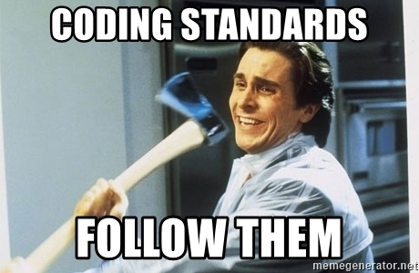

## Trauma

The date is March 10, 2017. It's 7pm, and my EE 160 TA begins packing his things and starts closing up class. "I've been stuck on this .c for over two hours...! What the hell is going on...!?", I groan. My partner and I have been working on this class assignment where we must  manually calculate cosine. I had used all the hints my friends, peers, and TA had given me; was sure my pointers pointed to the right places; and manually traced the most complicated bits to make sure it worked; but the function simply wouldn't run correctly. I was saying my prayers and was ready to eat the lost points. However My TA, having pity on us (and also needing to kick us out to lock up the room), glanced over my work and pointed at line 57: "You forgot the space over here, buddy." 

This is why I think coding standards are important. 

## Mr. Miyagi

Coding standards are a lot like Mr. Miyagi from Karate Kid. It's strict, daunting, nitpicks at your mistakes and will not stop bugging you until you fix them. But over time, you make less mistakes, secretly training you towards being organized and flexible in your craft. Coding standards force the user to high standards, minimizing the amount of mistakes and improves readability for anyone looking in to your code. Although coding standards vary among different people with different expectations for different reasons, generally you SHOULD do these:

 <ul>
  <li>Give variables and functions distinguishable names.</li>
  <li>Consistent indenting after every level of code.</li>
  <li>Provide comments describing what certain functions and some bits of code do.</li>
  <li>Keep a consistent style of code throughout the program.</li>
</ul> 

The UI used in my Engineering class was incredibly bare bones, hardly telling you what was wrong with the program until you ran it and got hit with the ``ERROR`` messages. Annoying as that was, had I added proper indentions and easier-to-recognize variables, I would have turned in the program early and taken a nap till the next week. Luckily, JavaScript has its Mr. Miyagi. 

## Benefits of Coding Standards

I talk a lot, but what are the benefits of applying rules to code? I've listed what I think the important benefits are here: 

 <ul>
  <li>Improve a programmer's code literacy.</li>
  <li>Enforces readability, maintainability, and organization skills.</li>
  <li>Builds team efficiency and workflow.</li>
  <li>Looks nicer.</li>
</ul> 

## ESLint
Using ESLint with IntelliJ has been a lifesaver. Personally, I appreciate the ESLint alerts since I can be a clutz when it comes to remembering variable names, but the lightbulbs are distracting. Overall, my experience with ESLint has been mostly positive and I will continue using it. The few projects we have done for ICS 314 have warranted some easy-to-miss mistakes, so the Miyagi-esque enforcement is appreciated. 

``function numAdd(nums) {
  return _.reduce(num);
}``

If I time traveled back to EE160 and typed this out, nothing would be highlighted and there would be no red squiggly line to scream at me for being illiterate. And although the squigglies mean very little right now (as most of them had been petty little spacing issues), I guarantee they will be important in much bigger and longer code. So don't be gun-shy with the longer names! Coding standards are timeless, and help out in the long run. 

