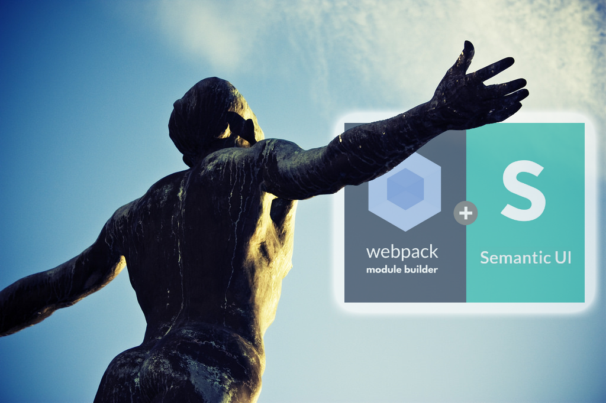
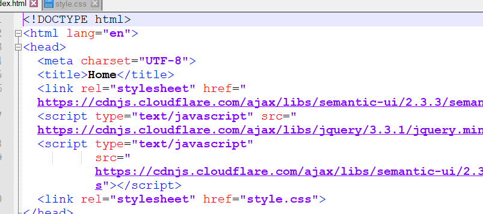
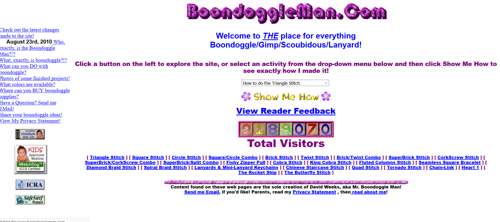

## -Introduction-

Learning HTML and CSS has been fun, but writing certain elements on a site can be difficult and confusing. UI Frameworks are fantastic because they are essentially shortcuts to implementations that normally would takes dozens of styling to write. Frameworks like Semantic UI are great in this regard because it has so many options and flexibility for each component they support. Although learning the shortcuts can be frustrating, in the long run it saves a few grey hairs and brain cells. 

## -Idiot-Friendly -

Tthe first thing I want to point out is the user-friendliness of implementing otherwise tricky and difficult elements of a website. It is also stupid easy to understand what the developer is trying to implement:

``ui borderless menu``

From a glance, you can tell almost exactly what is being implemented, without the hassle or confusion of regular CSS code. 

Importing the library is also as simple as adding a few lines of code! A powerful toolkit for the price of three lines of code. 

## -Flexible and Creative-

You can also mix and match classes together to create even more interesting elements and sections. 

Which of these websites would a normal, Internet-savvy consumer prefer?:

  
  

If you picked the latter, you may need to go exploring the internet a bit more, you heathen. For others, this is an excellent showcase of the power of customization provided by Semantic UI. It is a (albeit incomplete) replica of a website completely created using basic HTML and Semantic UI. There are many other options as well, but you may need to try those out for yourself. 

## -Conclusion-

All in all, UI Frameworks is a sub-language that makes building websites that much easier. It simplifies element definitions that would be otherwise difficult to implement, and allows many, many customization options to make your website appealing. It is a great UI designer language, and a frontend programmers's paradise. And although there may be a learning curve to a new framework, it is very much worth it in the long run. 

