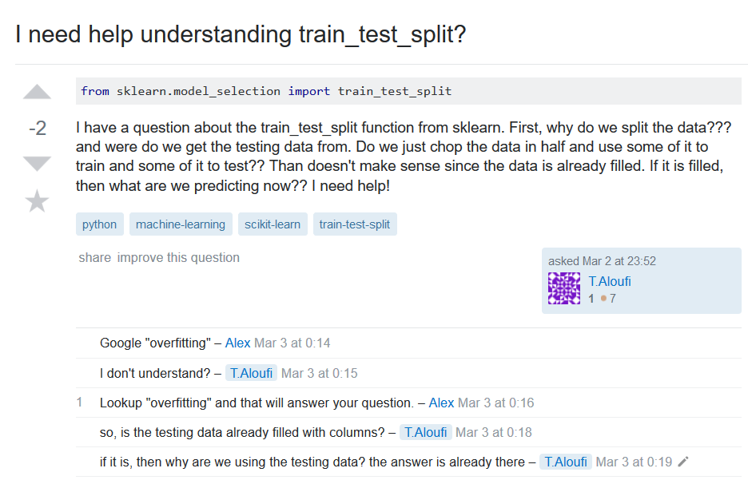
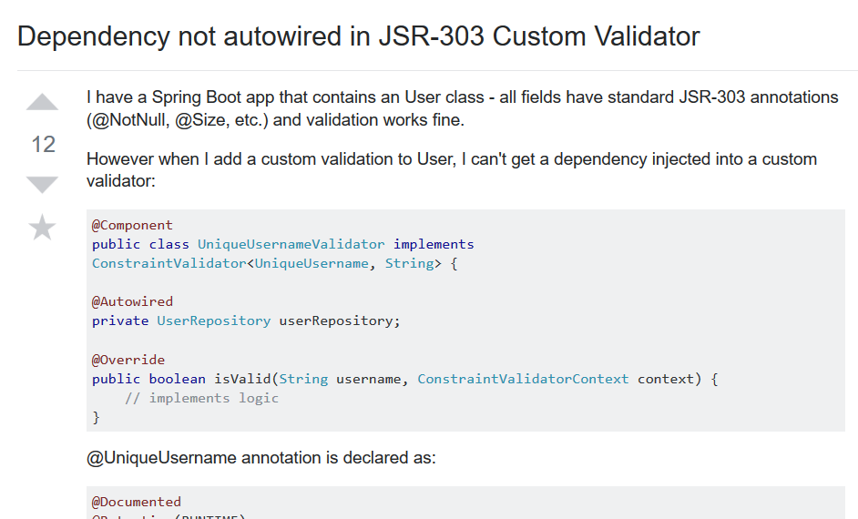
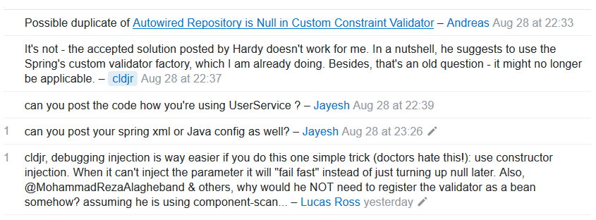

## What is a Dumb Question?

When I was a kid, my dad would always tell me: "Son, don't ask any dumb questions. If you ask dumb questions, you will get dumb answers." Unfortunately, he was right. There were times when the words would fly out of my mouth, and a face palm would come second. For example, there was this time when my friend and I were at Jungle Fun and he wanted to play Dance Dance Revolution, and I asked him, "Are you even good at this game?", and he replied, "No, are you?". And at point I wanted to go home because he was right, I absolutely suck at the game. Though, what properties make a question worthy enough of attention and a great answer? In Eric Raymond's [How to ask questions the smart way](http://www.catb.org/esr/faqs/smart-questions.html), he writes that there are many key components to making a question worth answering to, and lists common mistakes that newbies and idiots ask on online forums. If you haven't read it yet I highly recommend you do so. I will be using StackOverflow questions as examples of good and bad questions. 

## A [BAD](https://stackoverflow.com/questions/49079122/i-need-help-understanding-train-test-split) Question

In this example, there are a lot of noteable points that are wrong. In order to get any clicks on a query, the title header should be meaningful and specific, not a cry for help. Grammar should be clear and informative, and noted somewhere in the post that there was an attempt to understand and solve the problem. When posting a question, only post the symptoms of the problem, not guesses on why the program doesn't work. In the link above, the original poster had done none of these, coming off as an impatient student rushing to finish the problem before its due date. To top it off, the poster got hit with the (albeit family-friendly) 'stfw'. Sorry dude.

## A [GOOD](https://stackoverflow.com/questions/52066965/dependency-not-autowired-in-jsr-303-custom-validator) Question

On the contrary, the question above did things right. Titles are comprehensible and his question and description is to the point. There is an intended goal to reach, and he writes his steps out in detail. It is clear he has spent time and effort in attempting to fix this problem himself, although with little success. And to top it off, when replying to comments, he responds positively and politely, which is always appreciated by people trying to solve these problems for free. Good on you, ``cldjr``.

## Conclusion
In reality, there is no such thing as a bad question. All questions lead to some sort of answer, but the quality of the answer is only as good as its question. From this experience, I learned that attempting to research and solve the problem beforehand, choosing the right words for asking an online audience, and being polite are all keys to success in making a question worthy of attention and a great answer. Another piece of advice my dad gave me was, "There are a million different ways of saying the same thing." Had the posters heeded Eric Raymond's advice and changed how they asked their question, would have saved them from the wasted time and shame. 

