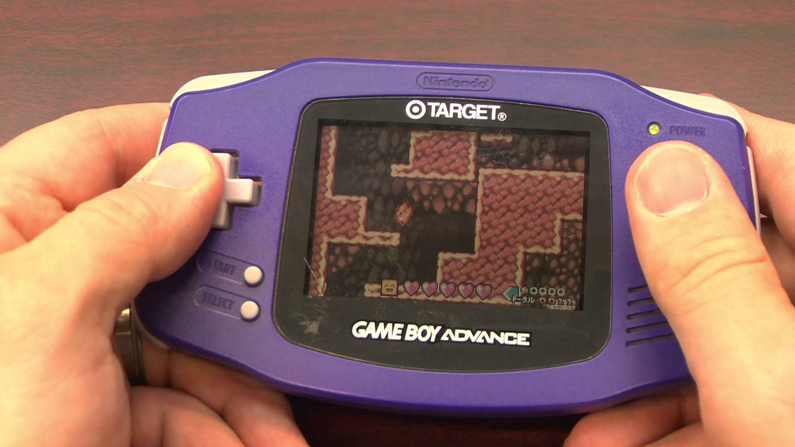
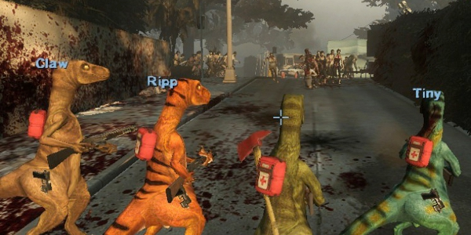
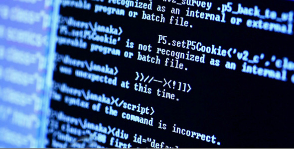

## -Childhood-

On my 6th birthday, I received a Game Boy Advance with a copy of Super Mario Brothers 3. It was the first electronic toy I had ever received. Opening up the top and powering it on was a portal to a whole new world of fire flowers and bouncing turtles. I just marveled at the idea of pressing a button and making a character on the screen jump at my command. It was from this experience that I declared my love for video games. 

From then on, I got all sorts of games and systems to play on, and I was the happiest little kid in all of Kaimuki. But then fifth grade came around, and it was middle school preparation day. A question had come up that I would be having to ponder for the next 8 years of my life:

“What do you want to be when you grow up?”

## -Existential Crises-

To be honest, I have never had an ambition for much else; I never enjoyed doing team sports, or reading books, or joining clubs and the like. I figured I could figure out my future "when I get there", and just relax and play video games all the time. Meanwhile, my addiction to video games had only gotten worse. At this point, I have taken over the family computer and the bandwidth, and my grades were steadily falling. As naughty and misbehaving as this sounds, this transition sparked my interest in programming. I tried to teach myself how to code to create a game in Unity, and learned to replace game objects in computer games, otherwise known as modding. 

The final push to computer science was not an apparent one. In my final year of high school, I was thoroughly convinced by friends and family to pursue the engineering program at UH Manoa, "because it suits you". Not yet knowing what I wanted to do for the rest of my life, I joined the engineering program. 

After my first year of engineering, I realized my interest was not in engineering or building mechanical parts or pieces. I found programming much more enjoyable to do. There is a strange feeling in seeing code come to life that building a circuit board doesn't fulfill. After my second semester at UH, I changed majors to Computer Science. 

## -What Now?-

The switch to Computer Science was interesting, since course requirements were a bit different, and I had no friends in the major. I was set back a year, but I have worked hard to get back on track to graduate by Spring 2020. 

After nearly a decade of being unsure of myself, I now have a goal for my future. I want to be a software engineer, a computer programmer. I want to become more fluent in multiple coding languages, create some interesting and punny programs, and one day create a video game. Although the future is unknowable, I look forward to what my remaining years of college have in store for me.

