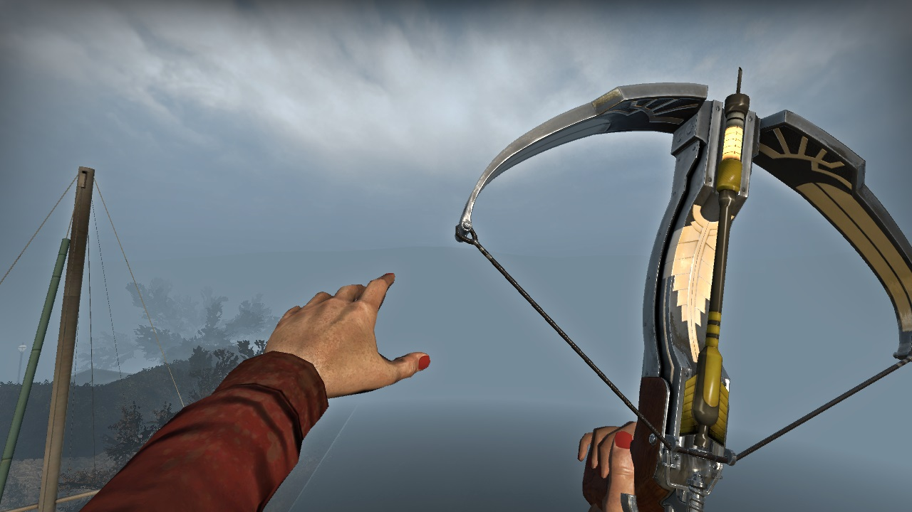
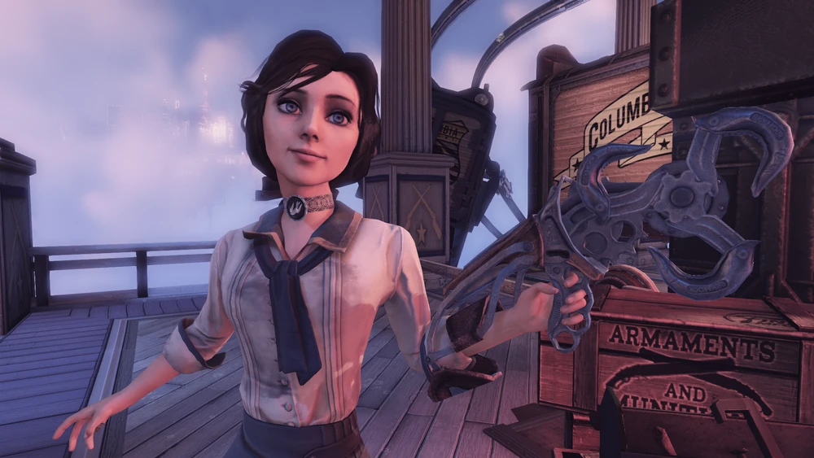
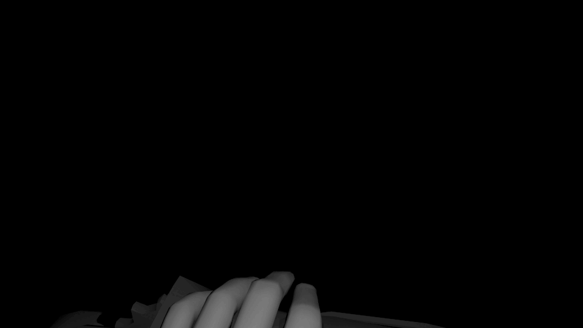

### Hey, catch!

The most addicting part of any video game is how it feels when you play: the weight and gravity of a jump, the velocity from launching a rocket at your feet, and the extra damage when timing an attack correctly. There are plenty of factors - sound design, game movement, how accessible and repetitive the mechanic is - but personally, the animations of a mechanic are what tie it all together. 

During the summer before my freshman year, I got into *Left 4 Dead 2*, a first-person zombie shooter campaign. The big draw for that game is its mod workshop, a niche community of fellow modders that bring their ideas into their own custom apocalypse. You can replace practically anything in-game; you could replace the adrenaline shot with a cup of coffee, or customize intense chase music with smooth jazz if you really wanted. 

My hyper-fixation at the time was a different game, *Bioshock Infinite*, a first-person action shooter. My favorite weapon the **Sky-Hook**, a leather glove attached to a rotary motor with magnetic scoops, was a weapon I thought would be coolest to use against zombies. But to my dismay this did not exist yet in the workshop. 

### Ambitions

I made it my goal to create my own Sky-Hook mod, and began researching how to make this possible. A few months later, using the open-source tools provided by the publisher, I released my first version of the melee weapon. It was a static model of the Sky-Hook replacing crowbars. During this process I learned how to open and repack game files, how to combine diffuse and normal maps, taught myself to use Blender for object manipulation and model creation, and how the Source Engine packages effects, sound, and animation into the game. 

And yet this first release did not feel right to me. The glove was held the wrong way, the hooks didn't spin like I wanted them to, and swung like a baseball bat. I thought it was enough to replace the object itself, but I realized that in order for the Sky-Hook to feel like a mechanical glove-drill, I needed to animate it like a mechanical glove-drill. So I did that.

Over the next year I would build my own skeleton rig for animations and used some stock first-person arms from the open-source .zip, and went through the painstaking process of recording gameplay and recreating these animations from scratch. I learned what keyframes were, what frames had to be exaggerated to get the feeling I wanted, and to adjust these animations to fit within the time set by the game.

The best example of exaggeration and adjustment had to be the knockback animation. The original knockback is only a half-second long, but in *Bioshock* it is almost a two-second mini cutscene. I made sure to recreate the important actions (grabbing the forearm with the opposite hand, then pushing away with both hands) and took creative liberties to make it quicker. 

### Feedback

This update had much better user feedback! It was a lot closer to what I wanted, and felt very cool to swing against the undead. The swing of the glove and the sound of impact against zombies all felt really powerful with my new animations. In 15 months I learned how to animate and create objects and textures, and has since exploded in subscribes and favorites. 

Throughout my college career, I would submit 20+ other weapons and enemies from the *Bioshock* universe into the workshop. Most of my mods have 2000 subscribers, with my most popular mod being the **Big Daddy** with 36000 subscribers! My latest custom animation was Elizabeth's crossbow. Although impractical in a zombie apocalypse, it feels incredible to draw and shoot shots in-game. 

### Final Thoughts

I have taken a break from game mod development, but I am proud to have made my contribution to this little gaming community. Hopefully in the future I will be able to create mods for another game or a different engine. 

