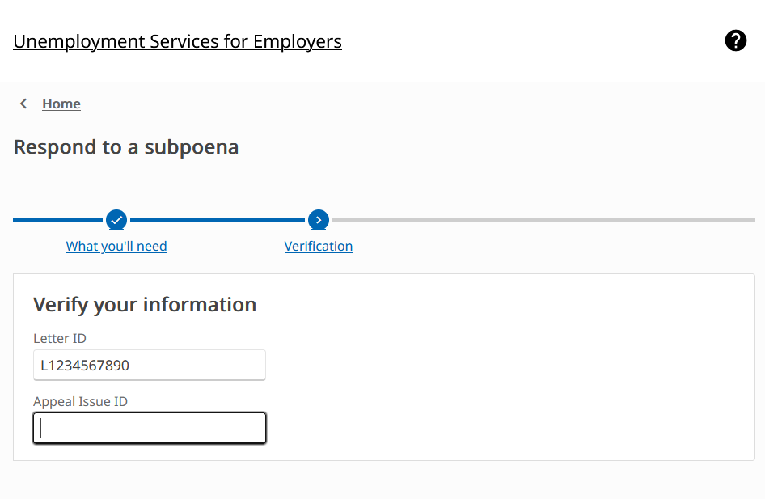

## Hello, Mt. Rainier!

I was an Implementation Consultant (IC) for FAST Enterprise starting in 2020 and was initially assigned an unemployment insurance (UI) project site based in Olympia, WA. During this time, the world had seen an unprecedented number of people unemployed and Washington’s UI program desperately needed an upgrade. 

After touching down in Washington State, I collaborated remotely with subject matter experts (SMEs), stakeholders, and fellow ICs to upgrade the current system to accommodate the ever-evolving UI policies and capacity of unemployment registrations.

## Highlights

Implemented ever-evolving unemployment insurance policies and a state-wide overpayment waiver program for Washington's Employment Security Department (ESD) during the COVID-19 pandemic. The waiver program focused on waiving $11.7 million in wrongful overpayments. 

Redesigned the existing unemployment tax system--in C# and SQL--for Massachusetts’ Employment Modernization and Transformation (EMT) project. Here our team collaborated with 30+ state subject matter experts to modernize their 20-year old system while ensuring compliance with updated policies. 

	
	<small class="text-muted">A screenshot of a frontend form for appeals, a subsystem I was heavily involved in. </small>

## Responsibilities

1. Resolving server requests, usually implementing a code or configuration change to fix a site issue reported by stakeholders. Server requests ranged in severity, colloquially termed "T-Shirt Sizes". Turnaround time for these server requests were typically two weeks, starting from developing in a local environment to testing in a production-like environment with unit testing. Developers provided test scenarios to be given to SMEs for thorough testing. 

2. Information gathering, which mainly consisted of querying against data tables for claimant data, unemployment benefit amounts, entitlement types, and/or other data. These reports are typically used to decide statewide policies, so precision and accuracy are always a priority. 

3. Knowledge transfer & mentorship. Many project sites trade ICs across other sites depending on state/project urgency, so an IC does not stick around one site for long. Because of this, it was important for every IC to share and learn knowledge about site politics and policies, along with current system kinks and ongoing projects. I set up a system using OneNote to track server request progress and my personal notes, and also kept in contact with my mentees throughout my time here.

## Want to learn more?

I cannot disclose more details publicly, so if you'd like to learn more about my work specifics here, please do not hesitate to reach out! 