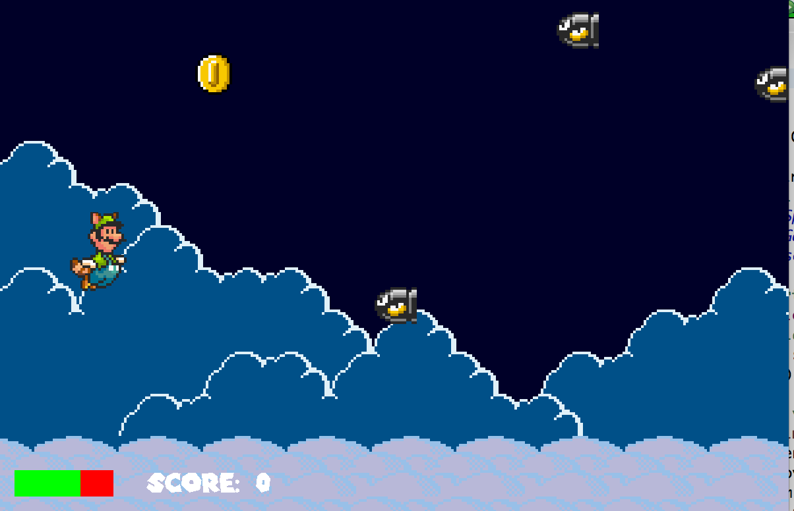

You can view the game repo <a href="https://github.com/altonlee/mario-flight-simulator">here!</a>

For ICS 111's Final project, I worked on a game inspired by Flappy Bird, written in Java. The goal of the game is to collect coins while avoiding Bullet Bills. The game gets incrementally faster and the player is given only three hit points before the game is over. 

I created the looping backdrop, timer, and player movement class. This game was my first experience developing with a small team. I learned some important life skills like communication, so we were on top of deadlines and didn't overwrite over another person's class. 