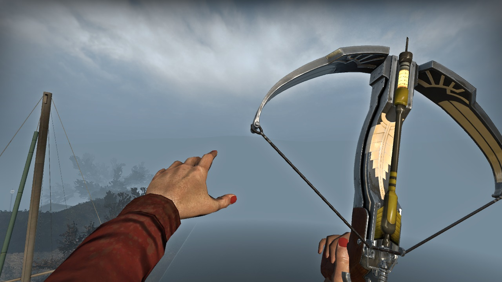

During the summer of my college freshman year, I got interested in video game modding. The game I used as a base for learning how to create game objects was a game called Left 4 Dead 2. My goal was to bring over some video game items and weapons from other games into this game. Creating animations and applying them into the game taught me animation and sound design, and reaffirmed my knowledge of C language. 

My very first project was to bring over this tool called the Sky-Hook from BioShock Infinite. However, the object I wanted to bring into this game had custom animations, which wasn't easy to replicate or import as other static models and props. So over the coming months, I planted myself in my room for several hours a day to learn how to animate. 

My first submission was a very depressing work of display; a static model of a glove, where the hooks weren't spinning, it was being held the wrong way, and swung like a baseball... It was cool seeing a creation come to life, but sad to see it wasn't the way I envisioned it. I wanted to work harder on it. It took an entire year of fixing animations and adjusting sounds before I had results I was happy with. 

Every submission came with criticism from friends and strangers alike, some useful, some hurtful. I made several other mods that have become popular in that game community. I've taken a break from making stuff due to school, but the last thing I was working on was an animation for a crossbow: 

I'm really proud of the work I have done, even though it's a silly hobby. I hope I can return to making mods and animations again, perhaps for another game. 
