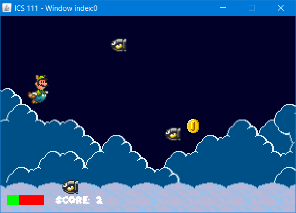

One of the projects we were assigned in ICS 111 was a custom project that could have any direction that my group wanted to take it. Although the outcome wasn't a difficult program to create nor a hard game to play, it was one of the major milestones in my life as a programmer where it challenged my knowledge of Java up to that point. 

Retrospectively, it is a very basic program and there are a lot of things that I want to go back and change about it, but it gives me something to look back on, and reminds myself that I must improve on my coding literacy and fluency. I have added a video of the gameplay below:

https://www.youtube.com/watch?v=7Q8WPcMoNAA

## Sample Code
Below is some code from my project: 
```js
	void Movement() {
		int movy = 7;
		// When W is pressed... move UP
		if (EZInteraction.isKeyDown('w') || EZInteraction.isKeyDown('W')) {
			// Change sprite to...
			if (chr == 'm')
				pc.setFocus(0, 129, 48, 198);
			else if (chr == 'l')
				pc.setFocus(49, 129, 96, 198);
			posy -= movy;
			pc.translateTo(posx, posy);
			if (posy <= 32)
				posy = 32;
		}
		// When S is pressed... move DOWN
		else if (EZInteraction.isKeyDown('s') || EZInteraction.isKeyDown('S')) {
			// Change sprite to...
			if (chr == 'm')
				pc.setFocus(0, 0, 48, 64);
			else if (chr == 'l')
				pc.setFocus(49, 0, 96, 64);
			posy += movy;
			pc.translateTo(posx, posy);
			if (posy >= maxHeight - 96)
				posy = maxHeight - 96;
		} else {
			if (chr == 'm')
				pc.setFocus(0, 65, 48, 128);
			if (chr == 'l')
				pc.setFocus(49, 65, 96, 128);
		}
	}
```

