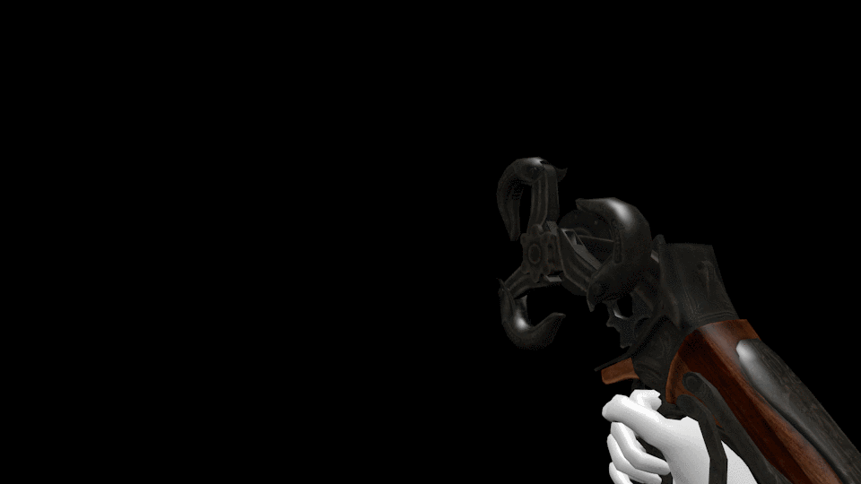

During the summer of my college freshman year, I got interested in video game modding. The game I used as a base for learning how to create game items was a game called Left 4 Dead 2. My goal was to bring over some video game items and weapons from other games into this game.

My very first project was to bring over this tool called the Sky-Hook from BioShock Infinite. However, the stuff I wanted to bring into this game had custom animations, which wasn't as easy to or replicate compared to a static model or custom textures to L4D2. So over the coming months, I planted myself in my room for several hours a day to learn how to animate. 

My first submission was a very depressing work of display; the hooks weren't spinning, it was being held the wrong way, swung the wrong way... I was proud yet embarrassed of it. *insert cool quote* I wanted to work harder on it. It wasn't until a whole year later that I was finally satisfied with the results. 

Every submission came with criticism from friends and strangers alike, some useful, some hurtful. I made several other mods that have become popular in that game community. I've taken a break from making stuff due to school, but the last thing I was working on was an animation for a crossbow: 

I'm really proud of the work I have done, even though it is merely a hobby without anything to benefit from it. I now have profound respect for people who work on full length movies and shorts that have multiple moving parts. It also reaffirmed my knowledge of C language (modified for the game, but similar) and taught me how to handle criticism and use it to inspire me to work harder on projects. 

