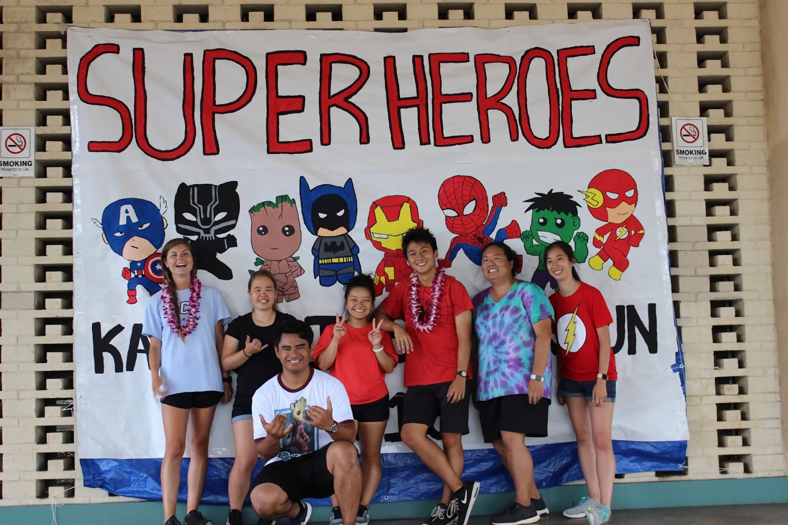

  

For the past three summers, I have worked as a Summer Fun Aide at Kaimuki Community Park here in Honolulu. I have been a Summer Fun Leader for first and second graders for two summers, and the Teen Leader for my last summer. Summer Fun lasts for six weeks, from mid-June to end of July. As Leaders, we must plan daily activities for the kids, which range from arts and crafts, sports and games, and music and dance. We also manage the teenage volunteers, AKA the Jr Leaders, to help us create an enjoyable summer for everyone. As the Teen Leader, I was solely responsible for Kaimuki's 2019 Finale "A Seuss-ical Summer", a scripted performance based on Dr. Seuss stories. 

You may be thinking, what does summer fun have to do with Computer Science? At first glance, it doesn't. In fact, it's safe to think that a software engineer has no place in a program of screaming kids, future teachers, and moody teenagers. However, working at the park has taught me many interpersonal skills, such as group management, leadership, and "people skills" that other jobs don't have the room for. Summer Fun has helped me exercise quick thinking and problem solving when things stop working, which happens a LOT in summer fun, and coincidentally, in coding. Working here has also allowed me to express myself creatively, allowing me to add as many puns and jokes previously known to be humanly impossible. 

I enjoyed working as a Summer Fun Leader, despite the hardships and drama. I really felt on top of the world, and every day was a best day of my life. Kaimuki Park has a special place in my heart, and I'll always know my way back home. The philosophy I gained from working here is "to compliment anyone's workflow", to work well with nearly anyone. Going forward, I hope to use these skills in any job in the future. 
