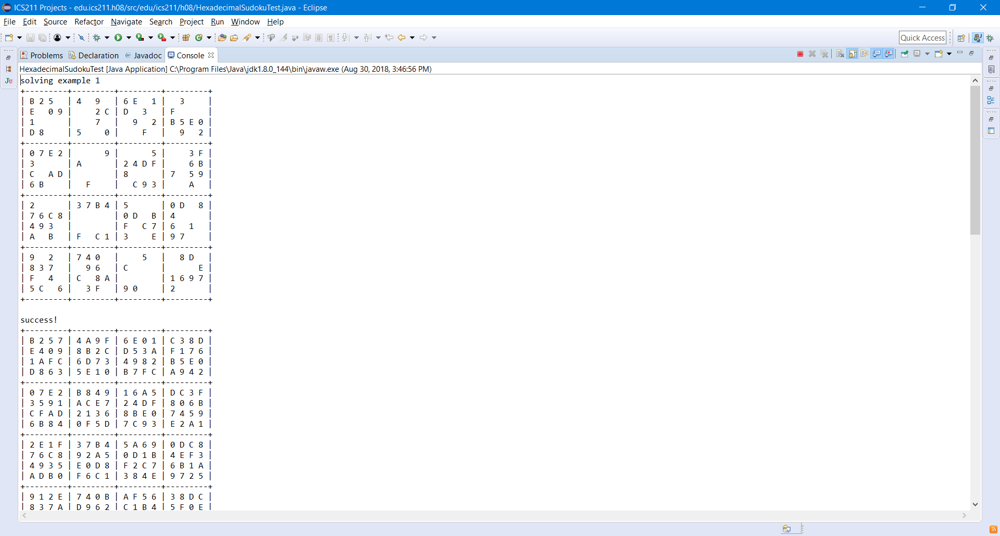

For one of the last few assignments for ICS 211, we had to create a sudoku solver using recursion. If given an input of an array of array of numbers, it should recursively solve the puzzle by "brute force" methodology. If there are any missing or invalid values, the function should fill in the function with valid numbers and still complete the sukoku puzzle. It should then print the sudoku puzzle as an actual board in the console. If the puzzle is unsolvable then the function would quit and the console would print unsolveable. 

This project assignment was also another milestone of my computer science career, as this project truly challenged my knowledge of Java. We also learned about backtracking and why recursion can be dangerous if not used properly, or if there is no quit method if the base condition is met. One of the test inputs our professor provided took almost an hour to solve! I remember when I finally figured it out, I was so excited and happy that I decided to reward myself with a nap. 

## Sample Code
Below is some code from the project:

```js
 /* check each cell for conflicts */
    for (int i = 0; i < sudoku.length; i++) {
      for (int j = 0; j < sudoku.length; j++) {
        int cell = sudoku[i][j];
        if (cell == -1) {
          continue; /* blanks are always OK */
        }
        if ((cell < 0) || (cell > 16)) {
          if (printErrors) {
            System.out.println("sudoku row " + i + " column " + j + " has illegal value "
                + String.format("%02X", cell));
          }
          return false;
        }
   ...
```

