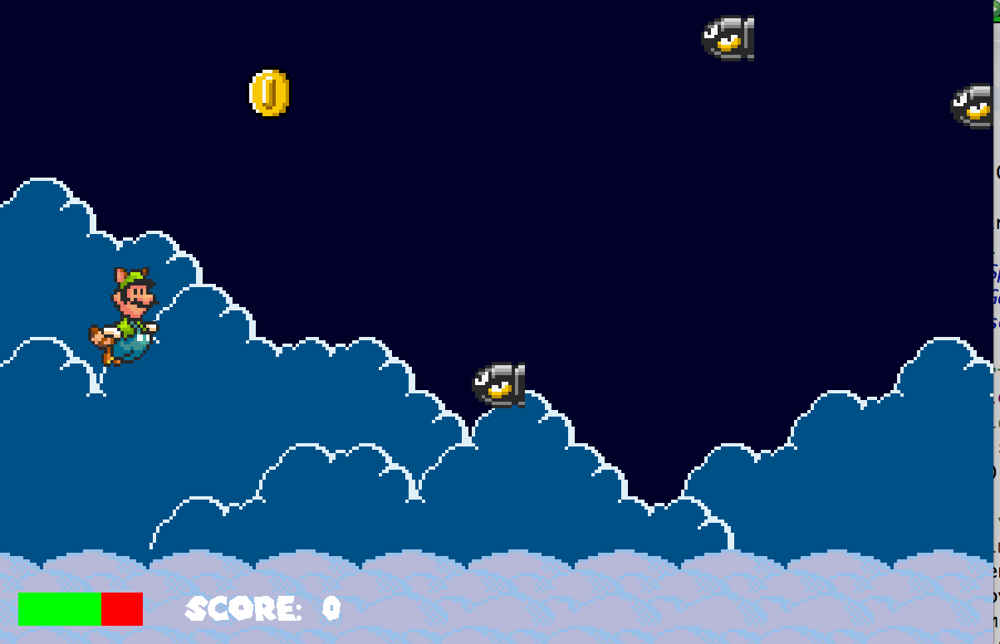

You can view/play our humble game <a href="https://github.com/altonlee/mario-flight-simulator">here!</a>

For ICS 111's Final project, I worked with Angeli Amascual and Koby Villalobos on a game inspired by Flappy Bird, written in Java. The goal of the game is to collect coins while avoiding flying enemies. The game gets incrementally faster and the player is given only three hit points before the game is over. 

This project was my first experience working in a programming team. Communication was vital for this project to work well, so we don't accidentally step on each others toes and write or overwrite someone's code. 

My contributions to this project include creating the backdrop, timer, and player movement class. Since this project was our first real taste in Java and project-oriented programming, the source files are evidently unoptimized. 
